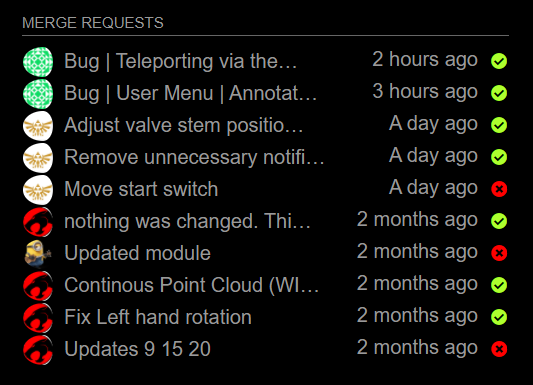

# Module: MMM-Gitlab-MergeRequests
Module to show open merge requests in Gitlab. Works  with self hosted instance as well as gitlab.com. 

This follows the gitlab api for merge requests pretty closely, so you should be able to easily configure
this to return the items you care about.



# Installation/Setup
1. You need to get a Personal Access Token from your gitlab instance. This token only needs the `read-api` scope. [See Creating a personal access token] (https://docs.gitlab.com/ee/user/profile/personal_access_tokens.html#creating-a-personal-access-token).
2. MagicMirror requeires Third Party modules to be cloned in the modules directory.
   ```
   cd <Your MagicMirror Directory>/modules
   git clone https://github.com/jkschoen/MMM-Gitlab-MergeRequests.git
   cd MMM-Gitlab-MergeRequests
   npm ci # install dependencies with pinned versions
   ```
3. Edit the `config/config.js` file to add our module, and edit the configuration 
   to your liking. Below is an example configuration to give you an idea.
   ```
   {
        module: "MMM-Gitlab-MergeRequests",
        header: "Merge Requests",
        position: "top_left",
        config: {
            gitlabUrl: "https://gitlab.example.com",  //custom gitlab insance
            accessToken: "dfdsafadsfasdfad", //your gitlab personal api token
            maxEntries: 20, //hom many to show
            fade: false, //turn off fade
            state: "opened", //only returned open merge requests
            orderBy: "created_at", // field to order the results by
            sort: "desc", // order direction
            scope: "all", // scope of merge requests to return
            wip: "no" //don't return WIP merge requests
        }			
	}
    ```
# Confguration Options

| Name           | Description |
|----------------|---------------------------------|
| `gitlabUrl`      | Url to your gitlab instance. You only need to set this if you are not using gitlab.com <br><br> **Possible values:** valid urls **Default value:** _https://gitlab.com_ |
| `accessToken`    | Your GItlab Personal Access Token with `read-api` scope. <br><br>[See Creating a personal access token] (https://docs.gitlab.com/ee/user/profile/personal_access_tokens.html#creating-a-personal-access-token) |
| `tableClass`     | Name of the classes issued from `main.css`. <br><br>**Possible values:** xsmall, small, medium, large, xlarge. <br> **Default value:** _small._
| `reloadInterval` | How often does the content needs to be fetched? (Seconds) <br><br> **Possible values:** `1` - `86400` <br> **Default value:** `300` (5 minutes)
| `maxEntries`     | The maximum number of events shown. <br><br> **Possible values:** `0` - `100` <br> **Default value:** `10`
| `gitlabGroup`    | The ID of your group that you want to get the merge requests from <br> **Default Value:** `""`
| `maxTitleLength` | The maximum title length. <br><br> **Possible values:** `10` - `50` <br> **Default value:** `25`
| `wrapEvents`     | Wrap event titles to multiple lines. Breaks lines at the length defined by `maxTitleLength`. <br><br> **Possible values:** `true` or `false` <br> **Default value:** `false`
| `fade`           | Fade the future events to black. (Gradient) <br><br> **Possible values:** `true` or `false` <br> **Default value:** `true` |
| `fadePoint`      | Where to start fade? <br><br> **Possible values:** `0` (top of the list) - `1` (bottom of list) <br> **Default value:** `0.25`
| `animationSpeed` | Speed of the update animation. (Milliseconds) <br><br> **Possible values:** `0` - `5000` <br> **Default value:** `2000` (2 seconds)
| `combineNames`   | Combines multiple merge requests into single line when title are identical. Helpful when working an issue across multiple repositories. **Possible values:** `true` or `false` <br> **Default value:** `false` |
| `showNamespace`  | Adds a line above the merge request title in smaller text showing the namespace <br><br> **Possible values:** `true` or `false` <br> **Default value:** `true` |
| `state`          | Return all merge requests or just those that are in specific state. opened, closed, locked, or merged. <br><br> **Possible values:** `opened`, `closed`, `locked`, or `merged`
| `orderBy`        | Return requests ordered by `created_at` or `updated_at` fields. <br><br> **Possible values:**  `created_at` or `updated_at` <br> **Default value:** `created_at`
| `sort`           | Return requests sorted in `asc` or `desc` order.  <br><br> **Possible values:**  `asc` or `desc` <br> **Default value:** `desc`
| `scope`          | Return merge requests for a given scope.  <br><br> **Possible values:**  `created_by_me`, `assigned_to_me` or `all` <br> **Default value:** `created_by_me`
| `milestone`      | Return merge requests for a specific milestone. `None` returns merge requests with no milestone. `Any` returns merge requests that have an assigned milestone.
| `labels`         | Return merge requests matching a comma separated list of labels. `None` lists all merge requests with no labels. `Any` lists all merge requests with at least one label. `No+Label` (Deprecated) lists all merge requests with no labels. Predefined names are case-insensitive.
| `createdAfter`   | Return merge requests created on or after the given time. Expected in ISO 8601 format (`2019-03-15T08:00:00Z`)
| `createdBefore`  | Return merge requests created on or before the given time. Expected in ISO 8601 format (`2019-03-15T08:00:00Z`)	 
| `updatedAfter`   | Return merge requests updated on or after the given time. Expected in ISO 8601 format (`2019-03-15T08:00:00Z`)
| `updatedBefore`  | Return merge requests updated on or before the given time. Expected in ISO 8601 format (`2019-03-15T08:00:00Z`)
| `authorId`       | Returns merge requests created by the given user `id`. Mutually exclusive with `authorUsername`. Combine with `scope=all` or `scope=assigned_to_me`
| `authorUsername` | Returns merge requests created by the given `username`. Mutually exclusive with `authorId`.
| `assigneeId`     | Returns merge requests assigned to the given user `id`. `None` returns unassigned merge requests. `Any` returns merge requests with an assignee.
| `approverIds`    | Returns merge requests which have specified all the users with the given `ids` as individual approvers. `None` returns merge requests without approvers. `Any` returns merge requests with an approver.
| `approvedByIds`  | Returns merge requests which have been approved by all the users with the given `ids` (Max: 5). `None` returns merge requests with no approvals. `Any` returns merge requests with an approval.
| `sourceBranch`   | Return merge requests with the given source branch
| `targetBranch`   | Return merge requests with the given target branch
| `search`         | Search merge requests against their `title` and `description`
| `in`             | Modify the scope of the search attribute. `title`, `description`, or a string joining them with comma. Default is `title,description`
| `wip`            | Filter merge requests against their wip status. `yes` to return only WIP merge requests, `no` to return non WIP merge requests
| `not`            | Return merge requests that do not match the parameters supplied. Accepts: `labels`, `milestone`, `author_id`, `author_username`, `assignee_id`, `assignee_username`
| `environmnet`    | Returns merge requests deployed to the given environment.
| `deployedBefore` | Return merge requests deployed before the given date/time. Expected in ISO 8601 format (`2019-03-15T08:00:00Z`)
| `deployedAfter`  | Return merge requests deployed after the given date/time. Expected in ISO 8601 format (`2019-03-15T08:00:00Z`)

